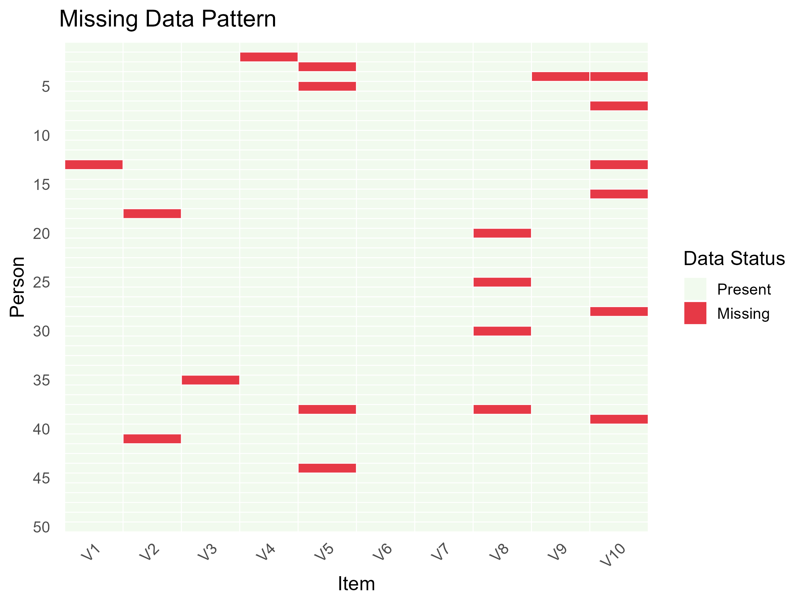

---
title: '``missalpha``: An R package for computing bounds of Cronbach''s alpha with missing data'
authors:
- name: Feng Ji
  orcid: 0000-0002-2051-5453
  affiliation: 1
  corresponding: true
  email: f.ji@utoronto.ca
- name: Biying Zhou
  orcid: 0000-0002-3590-3408
  affiliation: 1
affiliations:
- name: Department of Applied Psychology & Human Development, University of Toronto, Toronto, Canada
  index: 1
date: "\\today"
output: pdf_document
bibliography: paper.bib
tags:
- R
- Cronbach alpha
- Manski bound
- Reliability
---

# Summary

Cronbach's alpha is a widely used index of internal consistency and scale reliability in psychological and educational measurement. Despite its popularity, standard implementations often fail to account for missing data appropriately, leading researchers to either use ad-hoc methods or rely on listwise deletion. In practice, this can result in biased reliability estimates.

To address this, we developed `missalpha`, an R package that estimates the upper and lower bounds of Cronbach's alpha under arbitrary missingness mechanisms. Our approach is inspired by the concept of *Manski bounds* [@manski2003partial], offering researchers a robust, agnostic summary of reliability when the missing data mechanism is unknown or not easily modeled. `missalpha` implements both exact enumeration (for small problems) and optimization-based algorithms (for larger datasets), enabling principled worst-case scenario analysis for reliability.

# Statement of Need

In applied research, Cronbach's alpha is often reported as a point estimate and compared against conventional thresholds (e.g., 0.7 or 0.8) to judge scale adequacy [@nunnally1978psychometric]. However, in the presence of missing data, particularly when the missingness mechanism is unclear, standard point estimation may over- or under-estimate the true internal consistency of a scale.

Existing packages like `psych` [@revelle2017psych] and `ltm` [@rizopoulos2007ltm] compute alpha but assume complete data or impute missing entries without evaluating uncertainty in reliability caused by missingness. To our knowledge, no current package offers a general framework to compute bounds on Cronbach's alpha that remain valid under arbitrary missing data patterns.

The `missalpha` package fills this gap by providing tools to:
- Compute sharp lower and upper bounds of Cronbach's alpha under any missing data mechanism;  
- Perform sensitivity analysis via enumeration, Monte Carlo approximation, and global optimization;  
- Support both discrete (Likert-type) and continuous response formats.  

The package is useful when researchers seek to evaluate how missing data may affect conclusions about scale reliability, and when no strong assumptions about the missingness mechanism can be made.


# Package Features

`missalpha` provides the following main functionalities:

- `cronbachs_alpha()`: Unified wrapper function for computing alpha bounds via different methods.
- `compute_alpha_min()` / `compute_alpha_max()`: Core functions using binary search with optimization (e.g., GA, DEoptim, nloptr) to solve for alpha bounds.
- `cronbach_alpha_enum()`: Exhaustive enumeration of all missing value configurations for exact bound computation.
- `cronbach_alpha_rough()`: Monte Carlo approximation of alpha bounds for large-scale problems.
- `display_all()`: Function to compare and visualize results across all methods.

Internally, all methods formulate the alpha bound problem as a constrained nonlinear program and apply black-box solvers from `GA` [@scrucca2013ga], `DEoptim` [@mullen2011deoptim], and `nloptr` [@ypma2018package]. These solvers identify imputations of missing entries that minimize or maximize the alpha value, thus constructing the global worst-case bounds.

# Examples

To illustrate the usage of `missalpha`, we provide several examples demonstrating different methods to compute bounds on Cronbach’s alpha under missing data:

```r
  scores_df <- missalpha::sample
  scores_mat <- as.matrix(scores_df)
  result <- cronbachs_alpha(scores_mat, 4, enum_all = FALSE)
  summary(result)
```

The results are shown below:

```
> head(scores_df)
  V1 V2 V3 V4
1 NA  1  0  0
2  0  0  0  0
3 NA  0  0  0
4  2  0  0  1
5 NA  0  0  0
6  0  0  0  0

>   summary(result)
Summary of Cronbach's Alpha Bounds Calculation:

Optimization Method: GA
Alpha Min (Optimized): 0.000488
Alpha Max (Optimized): 0.403809

Runtime Information:
Total Runtime: 17.165619 seconds
```

In this example, we use a sample dataset (`missalpha::sample`) containing 50 individuals and 4 items with missing values. The item scores range from 0 to 4. The optimization-based method (`cronbachs_alpha()`) was applied using the default genetic algorithm (GA) with a score maximum of 4.

The estimated bounds for Cronbach’s alpha were `[0.000, 0.404]`, indicating a wide range of uncertainty in the internal consistency of the scale.

The total runtime of approximately 17 seconds reflects the computational cost of performing constrained optimization over all plausible missing value completions.

To further demonstrate the types of datasets that `missalpha` can handle, we generate a synthetic matrix with missing values using a Bernoulli process. This simulates a common testing scenario where some item responses are randomly missing across individuals. The matrix contains responses (0/1/2), and 20 entries out of the 500 entries are randomly set to missing (NA).

``` r
set.seed(0)
score_max <- 2
scores_mat_bernoulli <- generate_scores_mat_bernoulli(
  n_person = 50,
  n_item = 10,
  n_missing = 20,
  score_max = score_max
)

result = cronbachs_alpha(
    scores_mat_bernoulli, score_max, enum_all = FALSE
)
summary(result)
```

We can plot a missing map to show the generated dataset:



The visualization above provides a clear overview of random entries are missing.

The result is shown as:

```
> summary(result)
Summary of Cronbach's Alpha Bounds Calculation: 

Optimization Method: GA
Alpha Min (Optimized): 0.762207
Alpha Max (Optimized): 0.817871

Runtime Information:
Total Runtime: 19.001663 seconds
```

While the first example demonstrates how to compute alpha bounds using a single optimization method on a small-scale dataset, researchers may often be interested in comparing the behavior of different estimation strategies. The next example showcases how `missalpha` supports such comparisons through the `display_all()` function, which runs multiple methods—including rough approximation and different optimization solvers—on the same input matrix. This allows users to evaluate the trade-offs between computational efficiency and estimation precision.

```r
  all_result = display_all(scores_mat = scores_mat,score_max = 2)
  summary(all_result)
```

The results are shown below:

```
>   summary(all_result)
Rough_Integer_Method:
Alpha Min: 0.201523
Alpha Max: 0.392180
Runtime: 0.084263 seconds

Rough_Float_Method:
Alpha Min: 0.217747
Alpha Max: 0.392180
Runtime: 0.086584 seconds

Optimization_Method_GA:
Alpha Min: 0.194824
Alpha Max: 0.404785
Runtime: 16.930677 seconds

Optimization_Method_DEoptim:
Alpha Min: 0.192871
Alpha Max: 0.404785
Runtime: 1.099646 seconds

Optimization_Method_nloptr:
Alpha Min: 0.191895
Alpha Max: 0.404785
Runtime: 0.029727 seconds
```

This example demonstrates how `display_all()` can be used to compare multiple estimation strategies for Cronbach’s alpha bounds on the same dataset. Using a response matrix with scores ranging from 0 to 2, we evaluated five methods:

- **Rough Integer Sampling**: fast, coarse approximation using integer imputations; result: [0.202, 0.392].
- **Rough Float Sampling**: uses continuous sampling over [0, 2]; result: [0.218, 0.392].
- **Optimization (GA)**: more accurate but slowest; result: [0.195, 0.405], runtime ~17 seconds.
- **Optimization (DEoptim)**: faster than GA, similar result; runtime ~1.1 seconds.
- **Optimization (nloptr)**: fastest among optimization solvers; result: [0.192, 0.405], runtime < 0.03 seconds.

All methods produced similar upper bounds (~0.405), while lower bounds varied slightly depending on method and optimization strategy. Notably, the three optimization methods—GA, DEoptim, and nloptr—all produced nearly identical alpha bounds, with lower bounds ranging from 0.192 to 0.195 and a shared upper bound of 0.405. This consistency across solvers highlights the robustness and stability of the underlying optimization formulation in `missalpha`, ensuring that results do not depend heavily on the specific numerical algorithm chosen.

# Availability

The R package ``missalpha`` is publicly available on [Github](https://github.com/Feng-Ji-Lab/missalpha) (latest development version):

## Github
``` r
devtools::install_github("Feng-Ji-Lab/missalpha")
library(missalpha)
```


# References